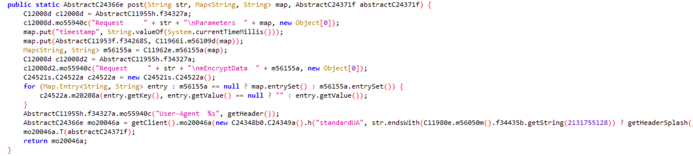
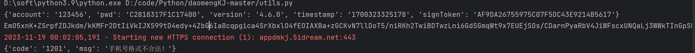
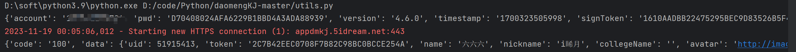
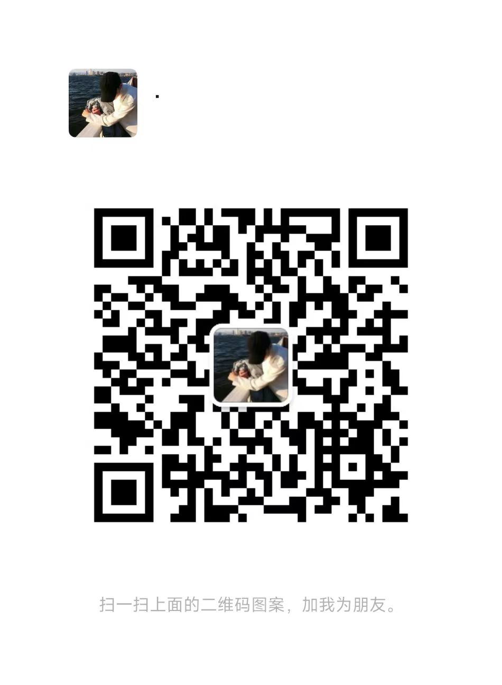

# 到梦空间

## v4.6.0 加密分析

目前最新版对接口进行了加密，网上找了一些脚本发现都用不了了，所以去研究了一下

仅供学习参考

#### 抓包

首先去抓了一下包，发现参数都是`d=xxx`，所以目前需要解决的问题就是研究这个参数来源

#### 反编译



反编译了一下apk，研究了一下post函数的源码，大致的操作是：

1. 往请求的参数添加时间戳参数`timestamp`
2. 往请求的参数添加`signToken`，值为一个`md5`字符串，大概的计算过程是对参数先进行`sha512`，然后将计算结果提取一部分字符再进行`md5`计算
3. 然后对整个请求参数进行加密，大概的流程为生成一个`key`，将这个key作为数据使用`RSA`公钥加密，然后使用这个key对参数进行AES加密，得出两个加密结果，拼接一下得出上面提到的d
4. 添加请求头等参数

#### 测试登录

由于密码还额外进行了Des加密，模式为`ECB/pkcs7`，key为`51434574`，账号密码都传123456做个测试，所以原始data大概长这样：

```json
{"account": "123456", "pwd": "C2818317F1C17400", "version": '4.6.0'}
```

添加时间戳，添加签名：

```json
{"account": "123456", "pwd": "C2818317F1C17400", "version": "4.6.0", "timestamp": "1700323096156", "signToken": "11474DEBAE3054B6B4B553F5102E492B"}
```

经过加密处理d=`EmO5xnK+ZSrpfZDJkdm/kKMFr2DtIiVkIJXS99tD4edy+4ZbG6Ia8cqpgica4SrXbxlO4fEOIAXBa+zGCKvN7llDoT5/niRKh2TwiBDTwzLni6GdSGmqWt9x7EUEjSOs/CDarnPyaRbV4JiWFscxUNQaLj3WWkTInGpSHwCg5TBLWd3BDTIxpJKgWOYdJai8YaU6KSuKq7W5ZFy1z1o/op+Y/6v/b8KC2puJhrUk2HTb+ldmvWQas+bdd+RAqv9wrsHRoujSvbVBckzr0oiRKG8vE1cjhBonHGXbPqQxCE+9rHMVqX1VuPp6anheTOlWTCcbQj3DL6L0C54MYTXK5Q1XP6O0jHspCgkTHbJ6mAg=`

使用Python发送请求测试，正常返回数据，说明请求成功：



修改为正确密码，登录成功：



#### 联系方式

